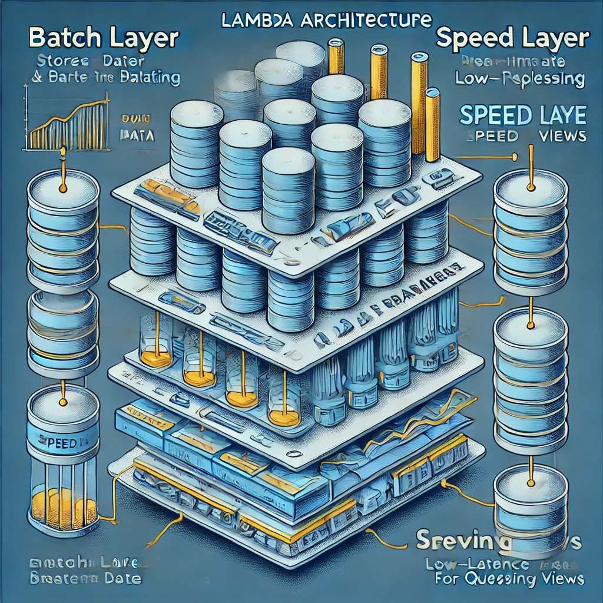

## Architektura systemów real-time

Wykorzystanie systemów real-time (czas rzeczywisty) w analizie danych wymaga odpowiedniej architektury, która będzie mogła szybko przetwarzać ogromne ilości danych oraz reagować na nie w czasie rzeczywistym. 
Architektura systemu real-time jest kluczowa, ponieważ umożliwia szybsze podejmowanie decyzji, monitorowanie procesów w czasie rzeczywistym i reagowanie na zdarzenia bez opóźnienia.

Omówimy główne elementy architektury systemów real-time, popularne wzorce architektoniczne oraz technologie, które są wykorzystywane do budowy takich systemów.

### Podstawowe elementy systemu real-time

Systemy real-time muszą spełniać szereg wymagań związanych z czasem przetwarzania danych. 
Istnieje kilka kluczowych komponentów w architekturze systemu, które zapewniają jego prawidłowe funkcjonowanie.

#### Producent danych (Data Producer)

Dane w systemie real-time pochodzą z różnych źródeł, takich jak:

- Czujniki IoT: np. monitorowanie maszyn w fabryce, urządzenia medyczne.
- Transakcje w czasie rzeczywistym: np. zakupy online, dane z giełdy.
- Dane użytkowników: np. logi użytkowników w aplikacjach mobilnych, dane z mediów społecznościowych.

#### Przesyłanie danych (Data Transport)

Dane muszą być szybko przesyłane do systemów, które mogą je analizować. 
W tym celu wykorzystywane są technologie strumieniowe, takie jak:

- Apache Kafka: popularny system do przesyłania danych w czasie rzeczywistym, zapewniający wysoką wydajność i niezawodność.
- Apache Pulsar: alternatywa dla Kafki, dedykowana do przetwarzania danych w czasie rzeczywistym z dużą ilością subskrybentów.

#### Przetwarzanie danych (Data Processing)

Dane w systemach real-time są często przetwarzane w strumieniu. Dwa główne modele przetwarzania to:

- Batch processing: Przetwarzanie danych w partiach, które może mieć opóźnienie, ale przetwarza dane w sposób efektywny. Może być wykorzystywane w kombinacji z systemami real-time do agregacji danych.
- Stream processing: Przetwarzanie danych w czasie rzeczywistym, bez opóźnień, w którym dane są natychmiastowo analizowane i przetwarzane.

#### Składowanie danych (Data Storage)

Przechowywanie danych w systemie real-time zależy od wymagań aplikacji. Dwa główne rodzaje przechowywania to:

- Data Lake: składowanie ogromnych ilości nieprzetworzonych danych w postaci surowych plików.
Bazy danych NoSQL: takie jak Cassandra, które umożliwiają szybki dostęp do danych w czasie rzeczywistym.
- Data Warehouse: składowanie przetworzonych danych w celu ich analizy.

#### Analiza i wizualizacja danych (Data Analytics and Visualization)

Po przetworzeniu danych w czasie rzeczywistym należy wykonać ich analizę i prezentację w sposób zrozumiały dla użytkownika:

- Dashboardy: narzędzia takie jak Grafana lub Kibana, które służą do wizualizacji wyników w czasie rzeczywistym.
- Machine Learning: zastosowanie algorytmów uczenia maszynowego w czasie rzeczywistym do klasyfikacji, wykrywania anomalii czy predykcji (np. wykrywanie oszustw).

### Popularne architektury systemów real-time

####  Lambda Architecture

Lambda Architecture to popularna koncepcja przetwarzania danych, która łączy przetwarzanie wsadowe z przetwarzaniem strumieniowym. To klasyczna architektura używana w systemach przetwarzania Big Data, która zakłada dwie warstwy:

- Batch Layer: przetwarzanie (dużych ilości) danych wsadowych, które są później wykorzystywane do analizy. Realizuje procesy przetwarzania w trybie offline
- Speed Layer (Real-Time Layer): przetwarzanie danych w czasie rzeczywistym, czyli napływające dane strumieniowe, np. z sensorów, social media, transakcji, w celu uzyskania natychmiastowych wyników.

- Serving Layer: warstwa, która łączy wyniki obu poprzednich warstw i dostarcza je do użytkownika np. za pomocą API.

 

#### Zalety i Wady Lambda Architecture:

- ✅ Możliwość łączenia przetwarzania wsadowego i strumieniowego, 
- ✅ wsparcie dla dużych zbiorów danych, 
- ✅ elastyczność w przetwarzaniu złożonych zapytań.
- ❌ Wymaga utrzymywania dwóch oddzielnych systemów do przetwarzania danych (batch i stream), co prowadzi do złożoności implementacji i utrzymania.

#### Kappa Architecture

Kappa Architecture jest uproszczoną wersją Lambda Architecture. 
Zamiast używać dwóch osobnych warstw (batch i speed), Kappa wykorzystuje tylko jedną warstwę przetwarzania strumieniowego, co upraszcza cały system. 

Jest to bardziej elastyczne podejście do budowy systemów real-time, zwłaszcza w przypadku, gdy dane są przetwarzane tylko w jednym trybie (streaming).

 

#### Zalety i Wady Kappa Architecture:

- ✅ Prostota: Jako że przetwarzanie danych odbywa się tylko w jednym strumieniu, cały system jest prostszy i bardziej spójny.
- ✅ Skalowalność: Dzięki eliminacji warstwy batch, system jest bardziej elastyczny i skalowalny w kontekście analizy danych w czasie rzeczywistym.
- ✅ Idealne dla ML: Kappa Architecture świetnie sprawdza się w zastosowaniach związanych z Machine Learning, ponieważ przetwarzanie danych odbywa się na bieżąco, co pozwala na szybsze uczenie i wdrażanie modeli ML w czasie rzeczywistym.
- ❌ Może być mniej wydajna przy bardzo dużych zbiorach danych, w przypadku, gdy wymagane jest skomplikowane przetwarzanie wsadowe.

#### Microservices Architecture

Architektura mikroserwisów jest powszechnie wykorzystywana w systemach real-time, ponieważ umożliwia:

- Podział aplikacji na mniejsze, autonomiczne jednostki.
- Elastyczność i skalowalność systemu.
- Możliwość przetwarzania różnych rodzajów danych przez różne mikroserwisy.
- Wykorzystanie komunikacji asynchronicznej, np. przez kolejki wiadomości.

#### Przykład 

Uber to przykład firmy, która skutecznie wykorzystuje narzędzia do przetwarzania strumieniowego, by monitorować ruch drogowy w czasie rzeczywistym. 
Dzięki systemowi Apache Kafka, Uber gromadzi dane o ruchu drogowym, lokalizacji pojazdów oraz czasach oczekiwania na przejazd, które są następnie analizowane na żywo.

Dane wejściowe: Informacje o czasie i miejscu podróży, dane GPS z pojazdów, natężenie ruchu.

Proces przetwarzania: Uber wykorzystuje Apache Kafka do przesyłania tych danych w czasie rzeczywistym do systemów takich jak Apache Flink lub Spark Streaming, które analizują je na bieżąco.

Analiza: System przewiduje czas oczekiwania na przejazd, monitoruje warunki drogowe oraz optymalizuje trasę w czasie rzeczywistym.

Wynik: Użytkownicy Ubera otrzymują prognozy czasu przejazdu, a Uber dynamicznie dostosowuje zasoby (np. przydzielanie kierowców), co umożliwia optymalizację transportu.